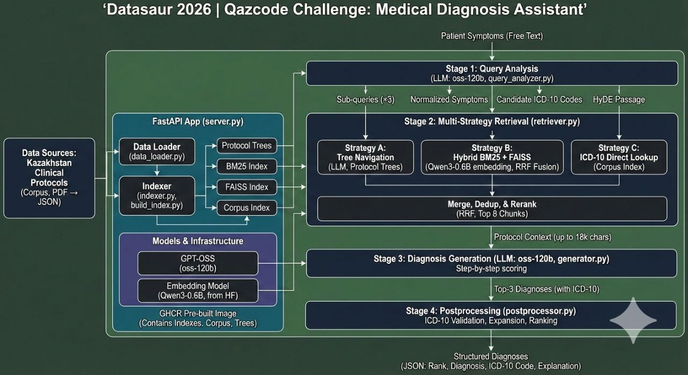

# Datasaur 2026 | Qazcode Challenge



## Medical Diagnosis Assistant: Symptoms → ICD-10

An AI-powered clinical decision support system that converts patient symptoms into structured diagnoses with ICD-10 codes, built on Kazakhstan clinical protocols.

---

## Challenge Overview

Participants will build an MVP product where users input symptoms as free text and receive:

- **Top-N probable diagnoses** ranked by likelihood
- **ICD-10 codes** for each diagnosis
- **Brief clinical explanations** based on official Kazakhstan protocols

The solution **must** run **using GPT-OSS** — no external LLM API calls allowed. Refer to `notebooks/llm_api_examples.ipynb`

---
## Data Sources

### Kazakhstan Clinical Protocols
Official clinical guidelines serving as the primary knowledge base for diagnoses and diagnostic criteria.[[corpus.zip](https://github.com/user-attachments/files/25365231/corpus.zip)]

Data Format

```json
{"protocol_id": "p_d57148b2d4", "source_file": "HELP-СИНДРОМ.pdf", "title": "Одобрен", "icd_codes": ["O00", "O99"], "text": "Одобрен Объединенной комиссией по качеству медицинских услуг Министерства здравоохранения Республики Казахстан от «13» января 2023 года Протокол №177 КЛИНИЧЕСКИЙ ПРОТОКОЛ ДИАГНОСТИКИ И ЛЕЧЕНИЯ HELP-СИНДРОМ I. ВВОДНАЯ ЧАСТЬ 1.1 Код(ы) МКБ-10: Код МКБ-10 O00-O99 Беременность, роды и послеродовой период О14.2 HELP-синдром 1.2 Дата разработки/пересмотра протокола: 2022 год. ..."}

```

---

## Evaluation

### Metrics
- **Primary metrics:** Accuracy@1, Recall@3, Latency
- **Test set:**: Dataset with cases (`data/test_set`), use `query` and `gt` fields.
- **Holdout set:** Private test cases (not included in this repository)

### Product Evaluation
Working demo interface: user inputs symptoms → system returns diagnoses with ICD-10 codes;

---
## Running the Solution

> **Use the pre-built GHCR image.** Indexes, corpus, and trees are baked in — no build step needed.
> Building locally requires rebuilding all indexes (~30 min) and produces non-deterministic vector layouts.

---

## Quick Start (GHCR)

### Step 1 — Prerequisites

- Docker installed
- `.env` file with credentials (copy from `.env.example`, fill `GPT_OSS_BASE_URL` and `GPT_OSS_API_KEY`)

### Step 2 — One-click run

```bash
./run.sh
```

That's it. The script will:
1. Read credentials from `.env`
2. Download the embedding model (~610 MB, one-time, from HuggingFace)
3. Pull the latest image from GHCR
4. Start the container on port 8080
5. Wait and confirm the server is healthy

When ready:
- Web UI → `http://localhost:8080/`
- API → `POST http://localhost:8080/diagnose`

Manual equivalent (if you prefer `docker run` directly):

```bash
docker pull ghcr.io/askhatsbk/qazcode-nu:latest

docker run -d \
  --name qazcode \
  -p 8080:8080 \
  -e GPT_OSS_BASE_URL=https://hub.qazcode.ai/v1 \
  -e GPT_OSS_API_KEY=<your-key> \
  -v $(pwd)/data/models:/app/data/models \
  ghcr.io/askhatsbk/qazcode-nu:latest
```

Watch logs:

```bash
docker logs -f qazcode
```

### Step 3 — Quick smoke test (10 cases, ~2 min)

```bash
mkdir -p /tmp/eval_quick
ls data/test_set/*.json | head -10 | xargs -I{} cp {} /tmp/eval_quick/

uv run python evaluate.py \
  -e http://localhost:8080/diagnose \
  -d /tmp/eval_quick \
  -n quick_test \
  -p 1
```

Results → `data/evals/quick_test_metrics.json` and `data/evals/quick_test.jsonl`

### Step 4 — Full evaluation (221 cases, ~40 min)

```bash
uv run python evaluate.py \
  -e http://localhost:8080/diagnose \
  -d data/test_set \
  -n v1 \
  -p 2
```

`-p 2` = 2 parallel requests (each request makes 2 LLM calls).

### Step 5 — Inspect failures

```bash
python3 -c "
import json
for line in open('data/evals/quick_test.jsonl'):
    r = json.loads(line)['scores']
    if not r['accuracy_at_1']:
        print(r['ground_truth'], '->', r['top_prediction'], r['top_3_predictions'])
"
```

---

### evaluate.py flags reference

| Flag | Default | Description |
|------|---------|-------------|
| `-e` | required | Endpoint URL, e.g. `http://localhost:8080/diagnose` |
| `-d` | required | Directory of `.json` test cases |
| `-n` | required | Run name (used for output filenames) |
| `-p` | `2` | Parallel requests |
| `-o` | `data/evals` | Output directory |

---

### Available image tags

| Tag | Meaning |
|-----|---------|
| `latest` | Latest build from `main` |
| `sha-<commit>` | Pinned to a specific commit |
| `v1.0.0` | Versioned release tag |

---

### Repo structure

| Path | Description |
|------|-------------|
| `src/server.py` | FastAPI app, `/diagnose` endpoint |
| `src/config.py` | LLM + embedding provider switching |
| `src/data_loader.py` | JSONL corpus loader, section parser |
| `src/indexer.py` | BM25 + FAISS index builder |
| `src/retriever.py` | 3-strategy retrieval + RRF fusion |
| `src/query_analyzer.py` | LLM query decomposition + HyDE |
| `src/generator.py` | LLM diagnosis generation |
| `src/postprocessor.py` | ICD-10 validation and ranking |
| `scripts/build_index.py` | Offline index builder |
| `evaluate.py` | Evaluation harness (Accuracy@1 / Recall@3) |
| `data/test_set/` | 221 local test cases |
| `data/evals/` | Evaluation outputs |
| `.github/workflows/docker-publish.yml` | Auto-publish to GHCR on push to main |

---

## Architecture

```
Patient symptoms (free text)
          │
          ▼
┌─────────────────────────────┐
│   Stage 1: Query Analysis   │  query_analyzer.py
│   LLM (oss-120b)            │
│                             │
│  • sub_queries (×3)         │  3 search angles: mechanism,
│  • normalized_symptoms      │  formal terms, differential
│  • candidate_icd_codes      │  5-8 likely ICD-10 prefixes
│  • hyde_passage             │  Fake "ДИАГНОСТИЧЕСКИЕ КРИТЕРИИ"
│                             │  in protocol language (HyDE)
└────────────┬────────────────┘
             │
             ▼
┌─────────────────────────────────────────────────────┐
│              Stage 2: Multi-Strategy Retrieval       │  retriever.py
│                                                     │
│  Strategy A — Tree Navigation (LLM)                 │
│    Protocol corpus → PageIndex trees                │
│    LLM picks relevant section nodes                 │
│                                                     │
│  Strategy B — Hybrid BM25 + FAISS  ← main path     │
│    Queries: original + sub_queries + hyde_passage   │
│    BM25 (lemmatized Russian) + dense (Qwen3-0.6B)  │
│    Fused with Reciprocal Rank Fusion (RRF)          │
│                                                     │
│  Strategy C — ICD-10 Direct Lookup                 │
│    Match candidate_icd_codes against corpus index   │
│    Returns diagnostic_criteria sections directly    │
│                                                     │
│  → Merge (A > C > B priority) → dedup → top 8 chunks│
└────────────┬────────────────────────────────────────┘
             │  up to 18 000 chars of protocol context
             ▼
┌─────────────────────────────┐
│  Stage 3: Diagnosis Gen     │  generator.py
│  LLM (oss-120b)             │
│                             │
│  • Step-by-step scoring:    │
│    match symptoms → criteria│
│  • Returns top-3 diagnoses  │
│    with ICD-10 codes        │
└────────────┬────────────────┘
             │
             ▼
┌─────────────────────────────┐
│  Stage 4: Postprocessing    │  postprocessor.py
│                             │
│  • Exact code → keep        │
│  • 3-char prefix → expand   │
│    to best corpus match     │
│  • Unknown code → drop      │
│  • Assign ranks 1-3         │
└────────────┬────────────────┘
             │
             ▼
  {"diagnoses": [{"rank":1, "diagnosis":"...",
                  "icd10_code":"J18.0", "explanation":"..."}]}
```

### Key files

| File | Role |
|------|------|
| `src/server.py` | FastAPI app, lifespan startup, `/diagnose` endpoint |
| `src/config.py` | Provider switching (LLM + embeddings), env var resolution |
| `src/data_loader.py` | Loads JSONL corpus, parses protocol sections, ICD lookup tables |
| `src/indexer.py` | Builds BM25 index, FAISS index, protocol tree structures |
| `src/retriever.py` | 3-strategy retrieval + RRF fusion + chunk selection |
| `src/query_analyzer.py` | LLM query decomposition + HyDE passage generation |
| `src/generator.py` | LLM diagnosis generation with step-by-step scoring prompt |
| `src/postprocessor.py` | ICD-10 validation, dedup, ranking |
| `scripts/build_index.py` | Offline index builder (run via indexer profile) |
| `evaluate.py` | Async evaluation harness, computes Accuracy@1 / Recall@3 |
